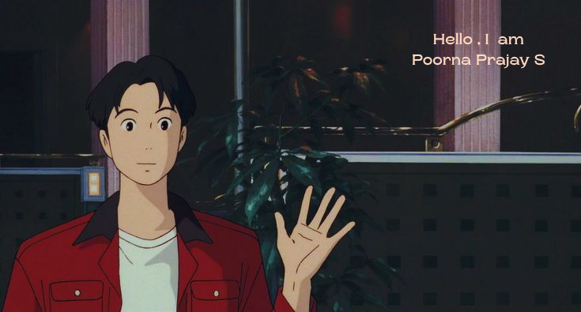
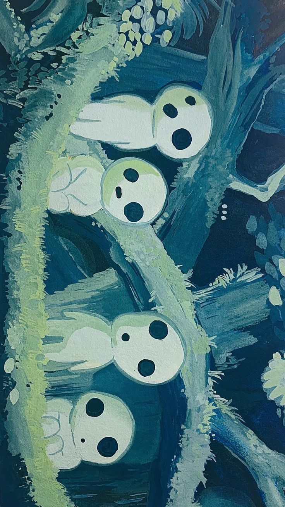

  
 

## 👨‍💻 About Me

I’m a Computer Science & Engineering student focused on building **real-world, scalable systems** that combine **software engineering, artificial intelligence, and data**.

Currently working as a **Wildlife Monitoring Intern**, contributing to a **3D Eco-Acoustic Monitoring Platform** that detects and classifies animal sounds using machine learning and distributed IoT systems.

I enjoy solving meaningful problems where technology creates real impact.

---

## 🛠️ Tech Stack

### 💻 Languages

  
  
  
  
  

### 🌐 Frontend & UI

  
  
  
  

### ⚙️ Backend & Systems

  
  
  
  

### 🤖 Data & Machine Learning

  
  
  
  

### 🗄️ Databases

  
  
  
  

---

## 🚀 Specializations

- Real-Time Data Streaming (Socket.IO & WebSockets)
- Full-Stack Engineering (Node.js + React + TypeScript)
- Desktop Applications (Electron.js)
- 3D Visualization (Three.js)
- Machine Learning for Audio Classification
- Scalable System Design & IoT Integration

---

## 📊 GitHub Stats

  

 

  

---

  <These are "Nature Spirits!">
  </b>

  
 

<!--
**poornaprajays/poornaprajays** is a ✨ _special_ ✨ repository because its `README.md` (this file) appears on your GitHub profile.

Here are some ideas to get you started:

- 🔭 I’m currently working on ...
- 🌱 I’m currently learning ...
- 👯 I’m looking to collaborate on ...
- 🤔 I’m looking for help with ...
- 💬 Ask me about ...
- 📫 How to reach me: ...
- 😄 Pronouns: ...
- ⚡ Fun fact: ...
-->
